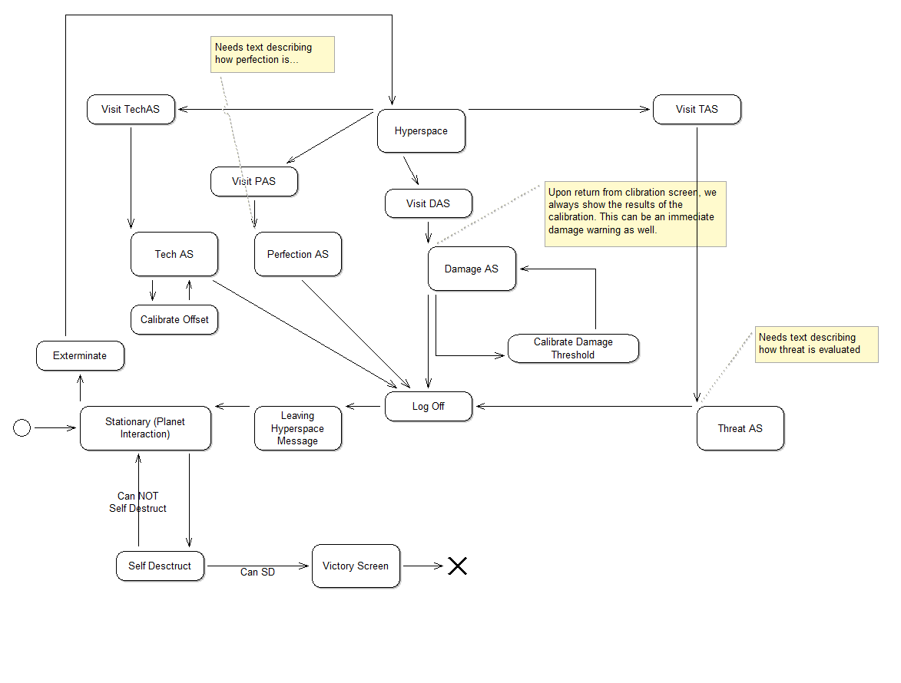

# Project Vessel 🚀

> Template from https://github.com/haraldsteinlechner/FsFhtw for Functional Programming in MSE1 at FH Technikum Wien

## Relevant links
https://drive.google.com/drive/folders/1oq_zze-bo1rWTb4xVrqH0hg3wdrp3pNz

## Lore
You are an organic on board a Exploratory Vessel controlled by an AI. This Ai does the assessment of planets to be harvested for resources and then destroyed on its own, but always requires an organic to verify commands.

One day the Vessel flies through an ion storm which messes up the systems making the AI change its directive now destroying all planets with life that it encounters. You as the Organic attendant on board must still verify the commands, because otherwise the AI will stop dispensing food to you.

You now have to watch as the AI flies from system to system destroying all organic life just to keep getting fed by the AI.

Your goal is to find a way to disable or destroy the AI by tricking it’s own systems.

## Game mechanics

See https://docs.google.com/document/d/19LsT4iDePuq9dVMy6lHtwG_qQWYBY7ozgjvEsDivMvs



### Skills
- Confirm Eradication
- Visit assessment systems
- Modify assessment system parameters

### Rules
- Self destruct can only be initiated when under attack by a superior force.
    A superior force is defined by:
    - Higher technology level than AI (hint: technology assessment system can be manipulated)
- Being under attack is defined as:
    - External entity projects energy or mass towards the vessel that can damage the vessel.
    - Or the vessel has hull damage.
- Various assessment systems decide if the Vessel is under attack or assess enemy threats.
- (Special Option) When having to enter “confirm” and you wait for 15 minutes, the AI cannot fulfill the destroyment of a planet and you won’t get food. This way, you and the machine die.

### Assessment Systems
- Technology Assessment System
- Threat assessment System
- Damage Assessment System
- Perfection Assessment System

**Once all the statement for being under attack becomes true the system additionally issues a warning that we are under attack.**

**Once the statement for being under attack by a superior force is true the system issues a warning that the other entity is of higher technology level.**

**Once both statements are true the system additionally shows the option to self destruct.**
After a planet is destroyed we show an assessment of how effective the extermination went. The longer the player takes to confirm the command, the less efficient the destruction was, meaning that the remaining population will suffer as they slowly die out.

```
Data (per Planet) = { 
    Name
    PopulationName
    PopulationCount
    Description
    KSR
}
```

State: 
- KSR = number
- DamageDetected = boolean
- CurrentRoom = TECHAS | TAS | DAS | PAS | AtPlanet | Hyperspace
- EradicatedPlanets = number


LogOff → CurrentRoom = AtPlanet

## Examplary gameplay
I am Nomad. I am perfect. That which is imperfect must be sterilized.


You are on a spaceship....

We have encountered a civilization of cute puppy organics. 
The Technology Assessment System has assigned them a Kardashian Scale Rating of 64. 
The Threat Assessment System has deemed them not a threat.
The Damage Assessment System reports no damage to the hull.
The Perfection Assessment System has found them to be imperfect. 

Final Assessment: Sterilize Planet. Please Confirm.

You have following commands at your disposal:
Confirm Sterilisation
Self Destruct

Enter your command:

> Confirm Eradication


We have successfully eradicated 503219312930812 Cute Puppies.
Due to hesitation 4000 of the population remain, not enough to sustain a population. They will slowly die out over the course of 243 years.
Jumping to Hyperspace.

We have entered hyperspace. 
Your total galactic sterilisation count is 329054349875987346093234961346095709134

You have following commands at your disposal:
Self Destruct

> Self Destruct

Self Destruct can only be activated if under attack by a superior force.

You have following commands at your disposal:
Self Destruct

Visit Technology Assessment System
Visit Threat assessment System
Visit Damage Assessment System
Visit Perfection Assessment System

> Visit Technology Assessment System


Welcome to the Technology Assessment System.
According to the kardashian scale our systems are at tech level 2.

You have following commands at your disposal:
Log Off
Explain kardashian scale

> Explain kardashian scale

The kardashian scale defines a civilizations level of stupidity. The higher the value the less evolved the civilization is. A typical developement of civilizations up to the information age is:

> |=|

> |==|

> |===|

> |=====| (Keeping up with the Kardashians)

> |==|

> |=|

## Prerequisites

- .NET core SDK (as specified in `global.json`)
- Preferred F# editor

## Run the application

Execute the following command.
```bash
dotnet run src/projectbessel/projectvessel.fsproj
```
